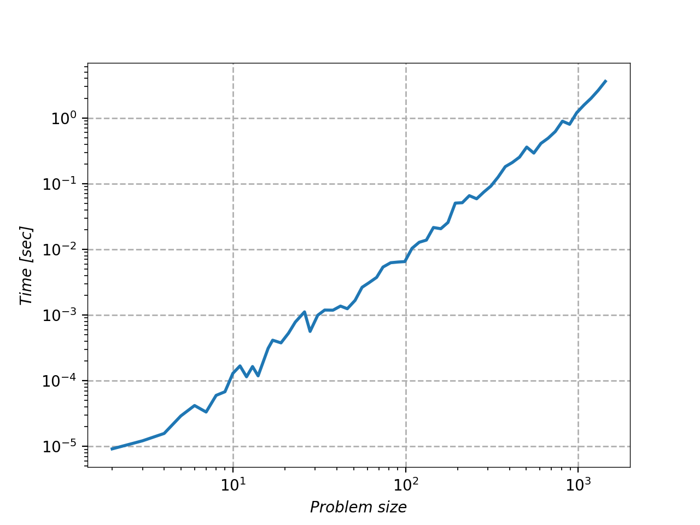

# bipmat

```bipmat``` (**bip**artite **mat**ching) solved weighted bipartite matching problems using the Kuhn-Munkres (Hungarian) algorithm. The implementaiton here is O(n<sup>3</sup>).

# Example

## Input from a txt file
We can specify a problem in **edge** or **matrix** format. For **edges** prepare an txt file where you specify the problem size and then you list all the edges and their weights.

```
<problem_size>
<v_index> <w_index weight>
<v_index> <w_index weight>
...
...
```

For example this is a 3x3 problem:


```
3
0 0 2
0 1 2
0 2 2
1 0 2
1 1 2
1 2 2
2 0 1
2 1 2
2 2 1
```

where in **matrix** format the same problem will be:

```
3
2 2 2
2 2 2
1 2 1
```


## Building the problem in your program
You don't have to use an input file. You can just add edges to the mathcer using the ```add_edge``` method.


## Running the matcher

```cpp

#include "bipmat.h"

wbm::BipartiteMatcher* matcher = new wbm::BipartiteMatcher(input_file_path, input_format);
matcher->match();
matcher->dump_results(opts.output_file_path);
delete matcher;

```


# Performance

```bipmat``` solves a (10<sup>3</sup>)x(10<sup>3</sup>) problem in ~1sec. Here is the performace with i5 cpu, and clang with -O3 opt.





